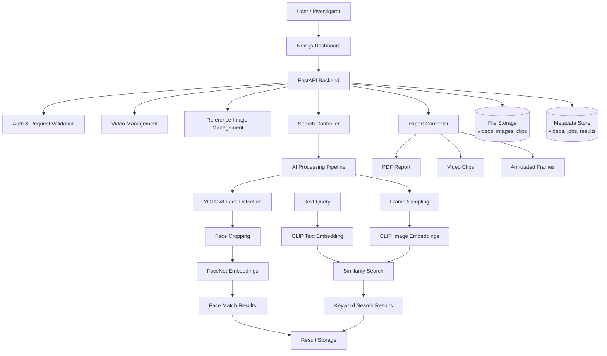
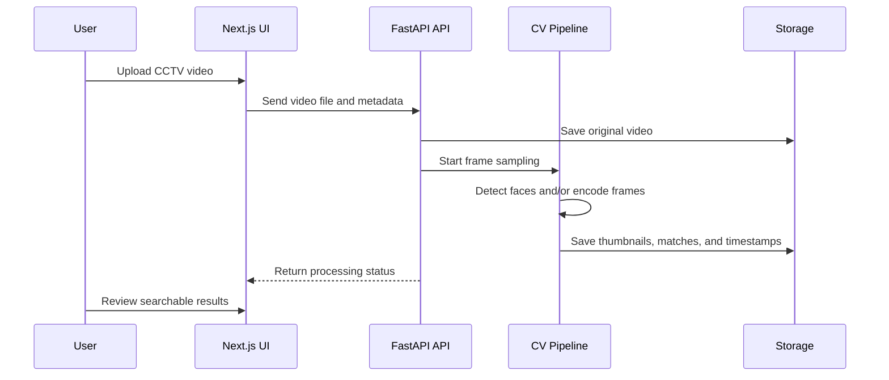
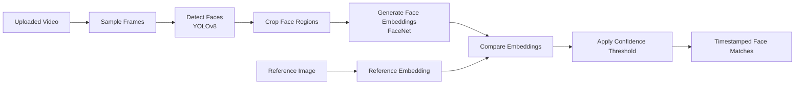
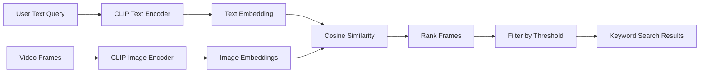
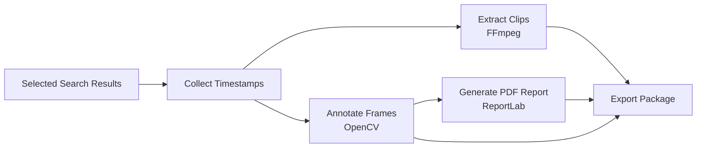

# VisionCCTV — AI-Powered CCTV Video Analysis

[](LICENSE)
[](https://www.python.org/)
[](https://fastapi.tiangolo.com/)
[](https://nextjs.org/)
[](https://www.docker.com/)

VisionCCTV is an AI-assisted CCTV analysis project for searching surveillance footage faster.  
It combines face detection, face recognition, frame processing, and CLIP-based text search so a user can upload CCTV footage, search for a person or scene, and export useful investigation results.

The project builds on the earlier `YOLOSystem` work and extends it into a more complete application with an API, dashboard, video-processing pipeline, and report/export flow.

---


kaggle notebook : https://www.kaggle.com/code/omchoksi04/faceidentificationsystemyolo


## Demo Showcase

<p align="center">
  
</p>

<p align="center">
  <b>GIF demo:</b> Face detection/tracking output from the YOLOSystem module.
</p>

> If the GIF does not render on GitHub, confirm that this file exists in the repository:  
> `YOLOSystem/result-videos/buffer-result.gif`

---

## What This Project Does

VisionCCTV helps with common CCTV investigation tasks:

- Upload CCTV footage.
- Upload or register reference images.
- Detect faces from video frames.
- Compare detected faces with reference faces.
- Search video frames using natural-language keywords.
- View timestamped matches and confidence scores.
- Export selected results as clips, annotated frames, or PDF reports.

---

## Core Features

### Face Search

- YOLOv8-based face detection from sampled video frames.
- FaceNet-based face embeddings for face comparison.
- Confidence thresholding to reduce weak matches.
- Timestamped result output for quick review.

### Keyword / Scene Search

- CLIP-based image and text embeddings.
- Natural-language queries such as `person wearing red shirt`, `car near gate`, or `crowd at entrance`.
- Similarity-based ranking of matching frames.

### Video Processing

- OpenCV-based frame extraction and preprocessing.
- Configurable frame sampling rate.
- Batch-style processing for uploaded footage.

### Export

- Timestamped frame extraction.
- Short video clip generation with FFmpeg.
- PDF report generation using ReportLab.
- Annotated result frames for investigation review.

### Web Application

- FastAPI backend for video, search, and export APIs.
- Next.js frontend for dashboard and investigation workflow.
- Docker-based local deployment.

---

## Architecture

### 1. High-Level System Architecture



### 2. Video Processing Flow



### 3. Face Recognition Pipeline



### 4. Keyword Search Pipeline



### 5. Export Flow



---

## Tech Stack

| Layer | Technology |
|---|---|
| Frontend | Next.js |
| Backend | FastAPI |
| Face Detection | YOLOv8 / Ultralytics |
| Face Recognition | FaceNet / facenet-pytorch |
| Text-to-Image Search | CLIP |
| Video Processing | OpenCV |
| Clip Extraction | FFmpeg |
| PDF Reports | ReportLab |
| Deployment | Docker / Docker Compose |

---

## Project Structure

```text
visioncctv/
├── backend/                 # FastAPI backend
├── frontend/                # Next.js frontend
├── YOLOSystem/              # Earlier YOLO-based prototype/demo files
│   └── result-videos/
│       └── buffer-result.gif
├── docs/                    # Extra documentation and diagrams
├── docker-compose.yml
├── README.md
└── LICENSE
```

---

## Quick Start

### 1. Clone the Repository

```bash
git clone https://github.com/OMCHOKSI108/visioncctv.git
cd visioncctv
```

### 2. Run with Docker

```bash
docker-compose up -d --build
```

### 3. Open the App

```text
Backend API: http://localhost:8000
API Docs:    http://localhost:8000/docs
Health:      http://localhost:8000/health
Frontend:   http://localhost:3000
```

---

## Environment Configuration

Create a `.env` file before running the project locally.

```env
PORT=8000
DEBUG=False

MAX_UPLOAD_SIZE=500MB
SAMPLE_FPS=1.0

FACE_CONFIDENCE_THRESHOLD=0.65
CLIP_SIMILARITY_THRESHOLD=0.70

UPLOAD_DIR=./storage/uploads
RESULT_DIR=./storage/results
REPORT_DIR=./storage/reports
```

---

## Backend Development

```bash
cd backend

python -m venv venv
source venv/bin/activate

pip install -r requirements.txt
uvicorn main:app --reload
```

Backend will run at:

```text
http://localhost:8000
```

---

## Frontend Development

```bash
cd frontend

npm install
npm run dev
```

Frontend will run at:

```text
http://localhost:3000
```

---

## API Overview

### Health

| Method | Endpoint | Purpose |
|---|---|---|
| GET | `/health` | Check backend status |

### Video Management

| Method | Endpoint | Purpose |
|---|---|---|
| POST | `/api/videos/upload` | Upload CCTV footage |
| GET | `/api/videos` | List uploaded videos |
| GET | `/api/videos/{video_id}` | Get video details |
| DELETE | `/api/videos/{video_id}` | Delete a video |

### Reference Images

| Method | Endpoint | Purpose |
|---|---|---|
| POST | `/api/references/upload` | Upload a reference face image |
| GET | `/api/references` | List reference images |

### Search

| Method | Endpoint | Purpose |
|---|---|---|
| POST | `/api/search/face` | Search video by reference face |
| POST | `/api/search/keyword` | Search video using text query |
| GET | `/api/search/jobs/{job_id}` | Check search job status |
| GET | `/api/search/results/{job_id}` | Get search results |

### Export

| Method | Endpoint | Purpose |
|---|---|---|
| POST | `/api/export/clip` | Export selected timestamps as video clips |
| POST | `/api/export/report` | Generate a PDF report |
| GET | `/api/export/{export_id}` | Download generated export |

---

## Example API Usage

### Upload Video

```bash
curl -X POST "http://localhost:8000/api/videos/upload" \
  -F "file=@surveillance.mp4" \
  -F "camera_id=CAM-01"
```

### Search by Keyword

```bash
curl -X POST "http://localhost:8000/api/search/keyword" \
  -H "Content-Type: application/json" \
  -d '{
    "video_id": "video_123",
    "query": "person wearing red shirt near entrance",
    "threshold": 0.70
  }'
```

### Search by Reference Face

```bash
curl -X POST "http://localhost:8000/api/search/face" \
  -H "Content-Type: application/json" \
  -d '{
    "video_id": "video_123",
    "reference_id": "ref_456",
    "threshold": 0.65
  }'
```

### Generate Report

```bash
curl -X POST "http://localhost:8000/api/export/report" \
  -H "Content-Type: application/json" \
  -d '{
    "job_id": "job_789",
    "title": "CCTV Investigation Report",
    "case_number": "CASE-001"
  }'
```

---

## Use Cases

- Reviewing long CCTV footage quickly.
- Finding a person using a reference image.
- Searching scenes or objects using natural-language text.
- Creating timestamped clips from important moments.
- Preparing a structured investigation summary.

---

## Notes on Accuracy and Safety

This project is an investigation-assistance tool, not a final decision-making system.

- Face recognition results should be manually reviewed.
- Similarity scores are not legal proof by themselves.
- Accuracy depends on camera angle, lighting, blur, video quality, and threshold settings.
- Generated reports should be treated as structured summaries unless validated by the responsible authority.

---

## Roadmap

- [ ] Add real dashboard screenshots.
- [ ] Add hosted demo link when available.
- [ ] Add async job queue for longer video processing.
- [ ] Add database-backed job tracking.
- [ ] Add role-based access control.
- [ ] Add multi-camera timeline view.
- [ ] Add advanced filters for camera, date, timestamp, and confidence.
- [ ] Add automated test coverage for API endpoints.

---

## Learning Resources

- [FastAPI Documentation](https://fastapi.tiangolo.com/)
- [Next.js Documentation](https://nextjs.org/docs)
- [Ultralytics YOLO Documentation](https://docs.ultralytics.com/)
- [FaceNet Paper](https://arxiv.org/abs/1503.03832)
- [CLIP Paper](https://arxiv.org/abs/2103.00020)
- [OpenCV Documentation](https://docs.opencv.org/)
- [FFmpeg Documentation](https://ffmpeg.org/documentation.html)

---

## License

This project is licensed under the MIT License. See the [LICENSE](LICENSE) file for details.

---

## Acknowledgements

- Ultralytics YOLO for object and face-detection workflows.
- FaceNet / facenet-pytorch for face embedding generation.
- CLIP for text-image similarity search.
- FastAPI for the backend API framework.
- Next.js for the frontend application.
- OpenCV and FFmpeg for video processing.

---

**VisionCCTV** — Search CCTV footage faster with AI-assisted video analysis.
