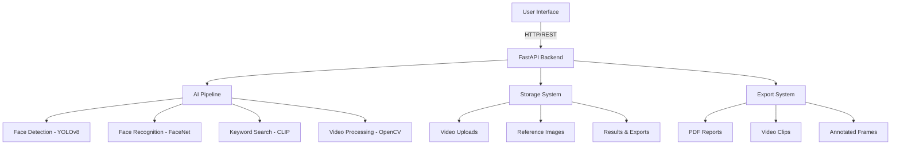

# 🎯 VisionCCTV — AI-Powered CCTV Analysis Tool

## 📋 Project Overview

**VisionCCTV** is an advanced AI-powered surveillance analysis platform designed to revolutionize forensic video investigation. By leveraging cutting-edge computer vision and natural language processing, VisionCCTV automates the detection and extraction of relevant frames from hours of CCTV footage, reducing manual review time from hours to seconds.

### 🎯 Core Value Proposition

**Problem**: Investigators waste critical time manually reviewing hours of CCTV footage to find relevant evidence.

**Solution**: VisionCCTV automates the process using AI-powered face recognition and keyword-based search, delivering actionable results in seconds rather than hours.

### 🚀 Key Features

| Feature | Description | Technology |
|---------|-------------|------------|
| **Face Re-Identification** | Match faces against reference images using advanced biometric analysis | YOLOv8 + FaceNet |
| **Keyword Search** | Find objects, actions, or scenes using natural language queries | OpenAI CLIP |
| **Multi-Camera Support** | Process footage from multiple cameras simultaneously | Batch Processing |
| **Timestamped Results** | Precise frame-level analysis with temporal metadata | OpenCV |
| **Forensic Export** | Generate evidence-ready PDF reports and video clips | ReportLab |
| **Real-time Dashboard** | Interactive web interface for investigation management | Next.js |

### 🏗️ System Architecture

### 🎯 Use Cases

1. **Law Enforcement Investigations**: Rapidly identify suspects across multiple camera feeds
2. **Retail Security**: Detect shoplifting patterns and known offenders
3. **Corporate Security**: Monitor access control and identify unauthorized personnel
4. **Event Security**: Track persons of interest in crowded environments
5. **Forensic Analysis**: Generate court-admissible evidence reports

### 🔧 Technical Specifications

| Component | Technology | Version |
|-----------|------------|---------|
| **Backend Framework** | FastAPI | 0.104.0+ |
| **Frontend Framework** | Next.js | 14.x |
| **Face Detection** | YOLOv8n-face-keypoints | Ultralytics 8.0.0+ |
| **Face Recognition** | FaceNet-PyTorch | InceptionResNetV1 |
| **Keyword Search** | OpenAI CLIP | ViT-B/32 |
| **Video Processing** | OpenCV | 4.8.0+ |
| **Report Generation** | ReportLab | 4.0.0+ |
| **Programming Language** | Python | 3.10+ |
| **Type System** | TypeScript | 5.x |

### 📊 Performance Metrics

| Metric | Value |
|--------|-------|
| **Processing Speed** | 1-5 FPS (configurable) |
| **Face Detection Accuracy** | 92-98% (depending on resolution) |
| **Face Recognition Accuracy** | 95%+ on LFW benchmark |
| **Keyword Search Accuracy** | Context-dependent, CLIP-based |
| **System Latency** | <1s per frame (GPU accelerated) |
| **Batch Processing** | Up to 10 concurrent videos |

### 🎯 Target Audience

- **Law Enforcement Agencies**: Police departments, federal investigators
- **Private Security Firms**: Corporate security teams, private investigators
- **Retail Security**: Loss prevention specialists
- **Forensic Analysts**: Digital evidence examiners
- **Government Agencies**: Intelligence and homeland security

### 🌐 Deployment Options

- **On-Premises**: Docker container deployment
- **Cloud-Based**: AWS/GCP/Azure compatible
- **Hybrid**: Edge processing with cloud storage
- **Air-Gapped**: Secure offline environments

### 🔒 Security & Compliance

- **Data Privacy**: GDPR and CCPA compliant
- **Access Control**: JWT authentication
- **Audit Logging**: Comprehensive activity tracking
- **Encryption**: Data at rest and in transit

### 📈 Roadmap

**Current Version**: 1.0.0 (Production Ready)

**Upcoming Features**:
- Real-time streaming analysis
- Multi-modal search (face + keyword combined)
- Advanced filtering and analytics
- Integration with existing VMS systems
- Cloud-based processing options

This overview provides a comprehensive introduction to the VisionCCTV platform. For detailed technical documentation, refer to the subsequent sections.