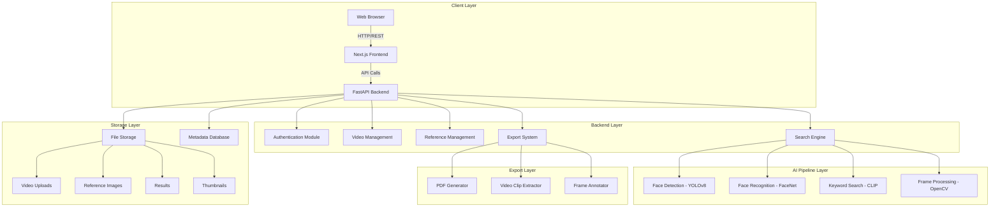
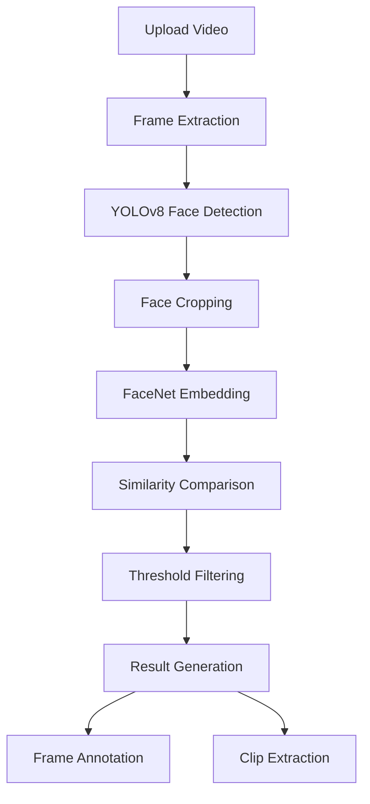
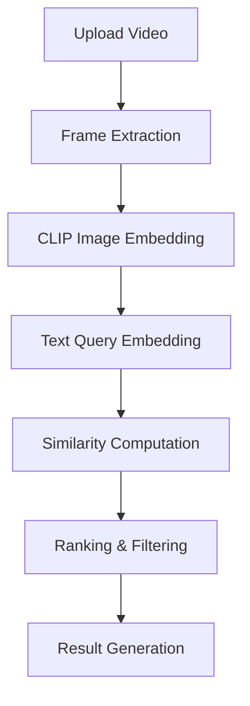
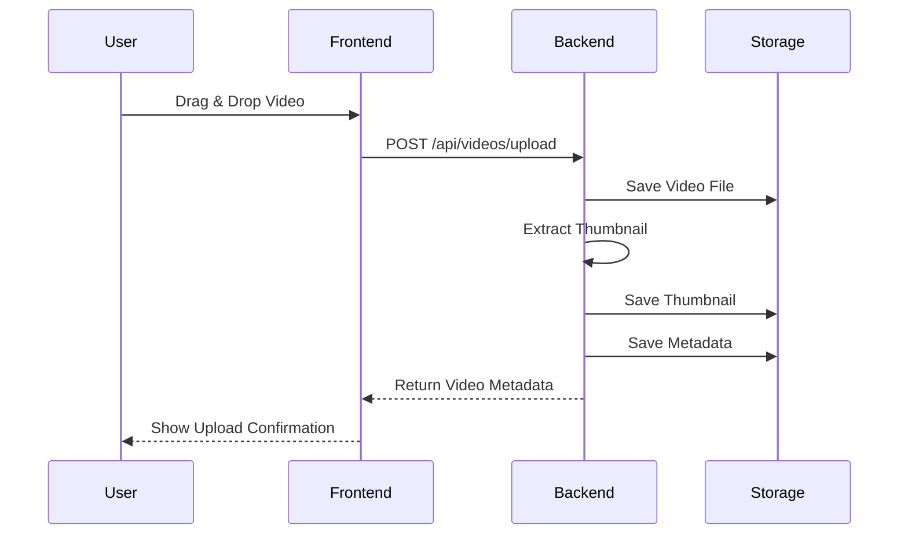
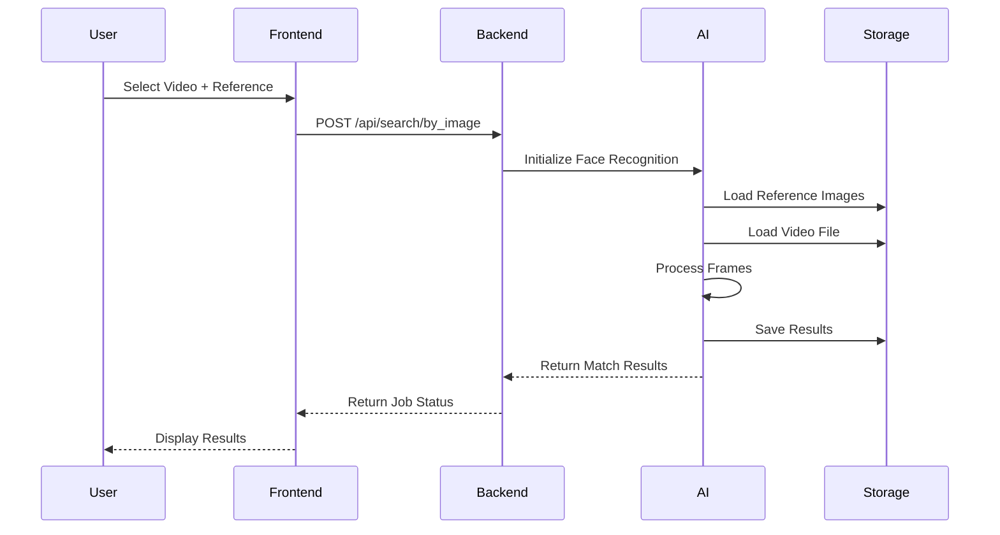
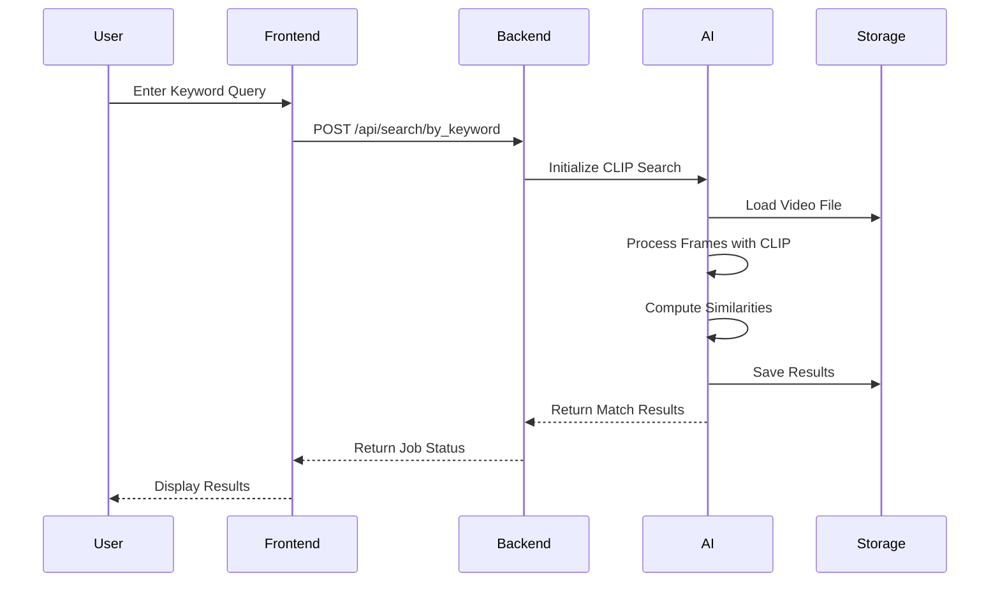
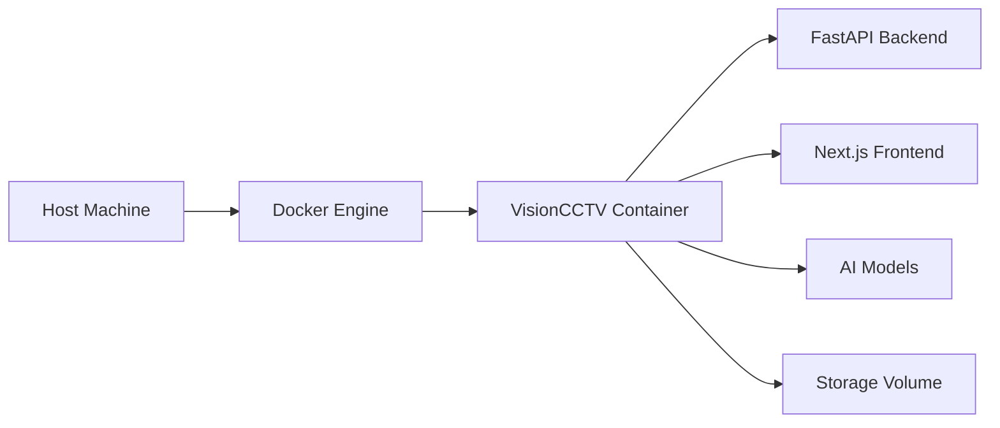
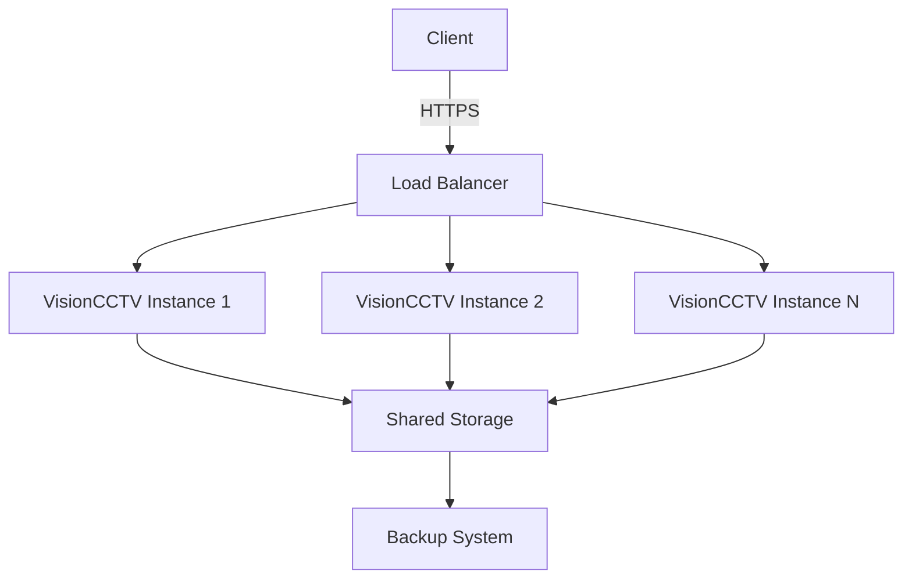

# 🏗️ System Architecture

## 📐 High-Level Architecture

VisionCCTV follows a modern, modular architecture designed for scalability, performance, and maintainability. The system is organized into distinct layers with clear separation of concerns.

### 🗺️ Component Diagram



### 📦 Module Structure

```
visioncctv/
├── frontend/                  # Next.js Web Application
│   ├── app/                   # Pages and Routes
│   ├── components/            # React Components
│   ├── lib/                   # API Clients and Utilities
│   └── public/                # Static Assets
│
├── backend/                   # FastAPI Backend
│   ├── main.py                # Application Entry Point
│   ├── ai_pipeline/           # AI Processing Modules
│   │   ├── face_recognition.py # YOLOv8 + FaceNet Pipeline
│   │   ├── keyword_search.py   # CLIP-based Search
│   │   └── frame_extractor.py  # Video Frame Processing
│   ├── routers/               # API Route Handlers
│   │   ├── videos.py           # Video Management
│   │   ├── references.py       # Reference Image Management
│   │   ├── search.py           # Search Operations
│   │   └── export.py           # Export Functionality
│   └── storage/               # File Storage (Volume Mounted)
│       ├── uploads/            # Uploaded Videos
│       ├── references/         # Reference Images
│       ├── results/            # Processed Results
│       └── thumbnails/         # Video Thumbnails
│
├── Face-Detection-and-Recognition-with-YOLOv8-and-FaceNet-PyTorch-main/
│   └── Original source code (reference)
│
├── docs/                      # Documentation
├── Dockerfile                 # Container Configuration
└── docker-compose.yml         # Orchestration
```

## 🔧 Technical Stack

### 🌐 Frontend Architecture

**Framework**: Next.js 14 (App Router)

**Key Components**:
- **AppLayout**: Main application layout with navigation
- **VideoUploader**: Drag-and-drop video upload interface
- **SearchPanel**: Face recognition and keyword search UI
- **ResultsGrid**: Interactive results display
- **ExportBar**: Evidence export controls

**State Management**: React Context API + local component state

**Styling**: Vanilla CSS with CSS Modules for scoping

### 🐍 Backend Architecture

**Framework**: FastAPI with Python 3.10+

**Key Features**:
- **Async I/O**: Non-blocking request handling
- **Dependency Injection**: Modular service architecture
- **CORS Support**: Cross-origin resource sharing
- **Static File Serving**: Direct media access

**API Design**: RESTful endpoints with JSON responses

### 🤖 AI Pipeline Architecture

#### Face Recognition Pipeline



#### Keyword Search Pipeline



### 🗃️ Storage Architecture

**File System Structure**:
```
storage/
├── uploads/               # Original video files
│   ├── video1.mp4
│   ├── video1.meta.json
│   └── video2.mp4
├── references/            # Reference images
│   ├── suspect1.jpg
│   ├── suspect1.meta.json
│   └── suspect2.jpg
├── results/               # Processing results
│   ├── job123/
│   │   ├── manifest.json
│   │   ├── face_job123_000001.jpg
│   │   └── clip_job123_000001.mp4
│   └── job456/
└── thumbnails/            # Video previews
    ├── video1.jpg
    └── video2.jpg
```

**Metadata Format**:
```json
{
  "id": "abc123",
  "original_filename": "surveillance.mp4",
  "stored_filename": "abc123.mp4",
  "camera_id": "CAM-01",
  "upload_time": 1712345678.123,
  "size_bytes": 12345678,
  "duration_seconds": 3600.5,
  "thumbnail_url": "/storage/thumbnails/abc123.jpg"
}
```

### 📦 Dependency Management

#### Python Dependencies

```bash
# Core Framework
fastapi>=0.104.0
uvicorn[standard]>=0.24.0
python-multipart>=0.0.6

# AI Models
opencv-python>=4.8.0
torch>=2.0.0
torchvision>=0.15.0
facenet-pytorch>=2.5.3
ultralytics>=8.0.0
transformers>=4.35.0

# Utilities
Pillow>=10.0.0
numpy>=1.24.0
reportlab>=4.0.0
aiofiles>=23.0.0
```

#### JavaScript Dependencies

```bash
# Core Framework
next@16.2.9
react@19.2.4
react-dom@19.2.4

# Development
typescript@^5
eslint@^9
eslint-config-next@16.2.9
```

## 🔄 Data Flow

### Video Upload Flow



### Face Recognition Search Flow



### Keyword Search Flow



## 🎛️ Configuration

### Environment Variables

```env
# Backend Configuration
PORT=8000
HOST=0.0.0.0
DEBUG=True

# Storage Configuration
STORAGE_DIR=./backend/storage
MAX_UPLOAD_SIZE=500MB

# AI Configuration
SAMPLE_FPS=1.0
CONFIDENCE_THRESHOLD=0.65
SIMILARITY_THRESHOLD=0.70

# Security
JWT_SECRET=your-secret-key
JWT_ALGORITHM=HS256
JWT_EXPIRE_MINUTES=60

# CORS
ALLOWED_ORIGINS=*
```

### Performance Tuning

**Frame Sampling**:
- `SAMPLE_FPS=1.0`: Process 1 frame per second (default)
- Higher values increase accuracy but reduce performance
- Recommended range: 0.5 - 5.0 FPS

**Confidence Thresholds**:
- `CONFIDENCE_THRESHOLD=0.65`: Minimum detection confidence
- `SIMILARITY_THRESHOLD=0.70`: Minimum recognition similarity
- Adjust based on desired precision/recall tradeoff

**Batch Processing**:
- Configure worker processes based on available CPU cores
- GPU memory limits for concurrent model inference

## 🔒 Security Architecture

### Authentication & Authorization

- **JWT Tokens**: Stateless authentication
- **Role-Based Access Control**: Admin vs. User roles
- **API Key Support**: For programmatic access

### Data Protection

- **Encryption**: TLS 1.2+ for all communications
- **Storage Security**: File system permissions
- **Audit Logging**: Comprehensive activity tracking

### Input Validation

- **File Type Validation**: Only allowed video formats
- **Size Limits**: Prevent resource exhaustion
- **Content Scanning**: Malware detection

## 📈 Scalability

### Horizontal Scaling

- **Stateless Backend**: Multiple FastAPI instances
- **Load Balancing**: Nginx or cloud load balancer
- **Shared Storage**: Network-attached storage

### Vertical Scaling

- **GPU Acceleration**: CUDA for AI models
- **Memory Optimization**: Batch processing
- **CPU Optimization**: Multi-threading

### Performance Optimization

- **Caching**: Reference embeddings and frequent queries
- **Lazy Loading**: Frontend performance
- **Chunked Processing**: Large video files

## 🧪 Testing Strategy

### Unit Testing
- **Backend**: pytest for API endpoints and utilities
- **Frontend**: Jest for React components
- **AI Pipeline**: Model validation and edge cases

### Integration Testing
- **API Contracts**: Endpoint compatibility
- **Data Flow**: Complete workflow validation
- **Error Handling**: Graceful degradation

### End-to-End Testing
- **User Journeys**: Complete investigation workflows
- **Performance**: Load testing with realistic data
- **Security**: Penetration testing

### Continuous Integration
- **Linting**: ESLint and Python linters
- **Testing**: Automated test suite
- **Build**: Docker image creation
- **Deployment**: Staging and production

## 🚀 Deployment Architecture

### Docker Containerization



### Production Deployment



### Monitoring & Logging

- **Metrics**: Prometheus for performance monitoring
- **Logging**: ELK stack for centralized logs
- **Alerting**: Critical event notifications
- **Tracing**: Distributed request tracing

This architecture documentation provides a comprehensive overview of the VisionCCTV system design. The modular, scalable approach ensures that the platform can handle growing demands while maintaining high performance and reliability.