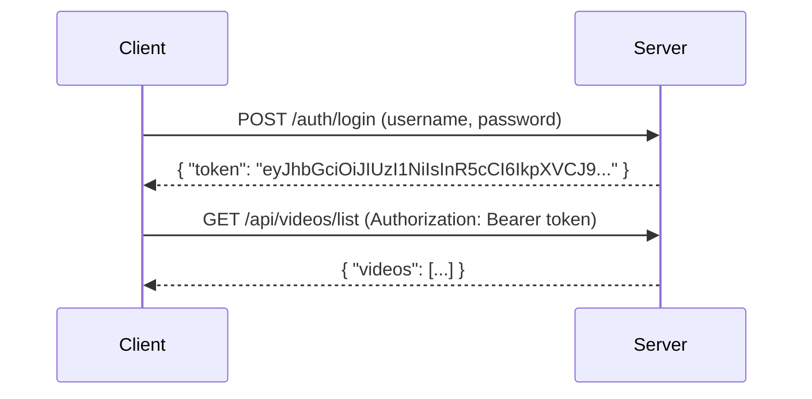

# 📚 API Reference

## 🔗 Base URL

```
http://localhost:8000/api
```

## 📋 Authentication

**Authentication Scheme**: JWT Bearer Token

**Security**: All endpoints require authentication except `/health` and `/docs`

**Token Format**:
```
Authorization: Bearer <your-jwt-token>
```

## 🎬 Video Management

### POST `/videos/upload`

**Description**: Upload a CCTV video file for analysis

**Authentication**: Required

**Request**:
```bash
curl -X POST "http://localhost:8000/api/videos/upload" \
  -H "Authorization: Bearer <token>" \
  -F "file=@surveillance.mp4" \
  -F "camera_id=CAM-01"
```

**Parameters**:

| Name | Type | Required | Description |
|------|------|----------|-------------|
| `file` | file | Yes | Video file (mp4, avi, mov, mkv, wmv) |
| `camera_id` | string | No | Camera identifier (default: "CAM-01") |

**Response**:
```json
{
  "success": true,
  "video": {
    "id": "abc123",
    "original_filename": "surveillance.mp4",
    "stored_filename": "abc123.mp4",
    "camera_id": "CAM-01",
    "upload_time": 1712345678.123,
    "size_bytes": 12345678,
    "duration_seconds": 3600.5,
    "thumbnail_url": "/storage/thumbnails/abc123.jpg"
  }
}
```

**Status Codes**:
- `201 Created`: Success
- `400 Bad Request`: Invalid file type
- `401 Unauthorized`: Authentication failed
- `500 Internal Server Error`: Processing error

### GET `/videos/list`

**Description**: List all uploaded videos

**Authentication**: Required

**Request**:
```bash
curl -X GET "http://localhost:8000/api/videos/list" \
  -H "Authorization: Bearer <token>"
```

**Response**:
```json
{
  "videos": [
    {
      "id": "abc123",
      "original_filename": "surveillance.mp4",
      "stored_filename": "abc123.mp4",
      "camera_id": "CAM-01",
      "upload_time": 1712345678.123,
      "size_bytes": 12345678,
      "duration_seconds": 3600.5,
      "thumbnail_url": "/storage/thumbnails/abc123.jpg"
    }
  ],
  "count": 1
}
```

### GET `/videos/{video_id}`

**Description**: Get metadata for a specific video

**Authentication**: Required

**Request**:
```bash
curl -X GET "http://localhost:8000/api/videos/abc123" \
  -H "Authorization: Bearer <token>"
```

**Response**:
```json
{
  "id": "abc123",
  "original_filename": "surveillance.mp4",
  "stored_filename": "abc123.mp4",
  "camera_id": "CAM-01",
  "upload_time": 1712345678.123,
  "size_bytes": 12345678,
  "duration_seconds": 3600.5,
  "thumbnail_url": "/storage/thumbnails/abc123.jpg"
}
```

### DELETE `/videos/{video_id}`

**Description**: Delete a video and its metadata

**Authentication**: Required

**Request**:
```bash
curl -X DELETE "http://localhost:8000/api/videos/abc123" \
  -H "Authorization: Bearer <token>"
```

**Response**:
```json
{
  "success": true,
  "deleted_id": "abc123"
}
```

## 👤 Reference Management

### POST `/references/upload`

**Description**: Upload a reference image for face recognition

**Authentication**: Required

**Request**:
```bash
curl -X POST "http://localhost:8000/api/references/upload" \
  -H "Authorization: Bearer <token>" \
  -F "file=@suspect.jpg" \
  -F "label=John Doe"
```

**Parameters**:

| Name | Type | Required | Description |
|------|------|----------|-------------|
| `file` | file | Yes | Image file (jpg, png, webp) |
| `label` | string | No | Descriptive label for the reference |

**Response**:
```json
{
  "success": true,
  "reference": {
    "id": "ref123",
    "original_filename": "suspect.jpg",
    "stored_filename": "ref123.jpg",
    "label": "John Doe",
    "upload_time": 1712345678.123,
    "image_url": "/storage/references/ref123.jpg"
  }
}
```

### GET `/references/list`

**Description**: List all reference images

**Authentication**: Required

**Request**:
```bash
curl -X GET "http://localhost:8000/api/references/list" \
  -H "Authorization: Bearer <token>"
```

**Response**:
```json
{
  "references": [
    {
      "id": "ref123",
      "original_filename": "suspect.jpg",
      "stored_filename": "ref123.jpg",
      "label": "John Doe",
      "upload_time": 1712345678.123,
      "image_url": "/storage/references/ref123.jpg"
    }
  ],
  "count": 1
}
```

## 🔍 Search Operations

### POST `/search/by_image`

**Description**: Perform face recognition search using reference images

**Authentication**: Required

**Request**:
```bash
curl -X POST "http://localhost:8000/api/search/by_image" \
  -H "Authorization: Bearer <token>" \
  -H "Content-Type: application/json" \
  -d '{
    "video_ids": ["abc123", "def456"],
    "reference_ids": ["ref123", "ref456"],
    "confidence_threshold": 0.65,
    "similarity_threshold": 0.70,
    "sample_fps": 1.0
  }'
```

**Parameters**:

| Name | Type | Required | Description | Default |
|------|------|----------|-------------|---------|
| `video_ids` | array | Yes | Array of video IDs to search | - |
| `reference_ids` | array | Yes | Array of reference image IDs | - |
| `confidence_threshold` | float | No | Minimum detection confidence (0.0-1.0) | 0.65 |
| `similarity_threshold` | float | No | Minimum recognition similarity (0.0-1.0) | 0.70 |
| `sample_fps` | float | No | Frames per second to sample | 1.0 |

**Response**:
```json
{
  "job_id": "job123",
  "status": "queued",
  "created_at": 1712345678.123,
  "video_count": 2,
  "reference_count": 2,
  "search_type": "face_recognition"
}
```

### POST `/search/by_keyword`

**Description**: Perform keyword-based search using CLIP

**Authentication**: Required

**Request**:
```bash
curl -X POST "http://localhost:8000/api/search/by_keyword" \
  -H "Authorization: Bearer <token>" \
  -H "Content-Type: application/json" \
  -d '{
    "video_ids": ["abc123"],
    "query": "man in red jacket running",
    "sample_fps": 1.0,
    "min_similarity": 0.60
  }'
```

**Parameters**:

| Name | Type | Required | Description | Default |
|------|------|----------|-------------|---------|
| `video_ids` | array | Yes | Array of video IDs to search | - |
| `query` | string | Yes | Natural language search query | - |
| `sample_fps` | float | No | Frames per second to sample | 1.0 |
| `min_similarity` | float | No | Minimum similarity score (0.0-1.0) | 0.60 |

**Response**:
```json
{
  "job_id": "job456",
  "status": "queued",
  "created_at": 1712345678.123,
  "video_count": 1,
  "query": "man in red jacket running",
  "search_type": "keyword"
}
```

### GET `/search/status/{job_id}`

**Description**: Get status of a search job

**Authentication**: Required

**Request**:
```bash
curl -X GET "http://localhost:8000/api/search/status/job123" \
  -H "Authorization: Bearer <token>"
```

**Response (In Progress)**:
```json
{
  "job_id": "job123",
  "status": "processing",
  "created_at": 1712345678.123,
  "updated_at": 1712345680.456,
  "progress": 0.45,
  "frames_processed": 450,
  "total_frames": 1000,
  "search_type": "face_recognition"
}
```

**Response (Completed)**:
```json
{
  "job_id": "job123",
  "status": "completed",
  "created_at": 1712345678.123,
  "completed_at": 1712345700.789,
  "match_count": 12,
  "processing_time_seconds": 22.56,
  "frames_analyzed": 1800,
  "search_type": "face_recognition",
  "matches": [
    {
      "camera_id": "CAM-01",
      "timestamp": 1234.56,
      "timestamp_str": "20:34:14",
      "frame_url": "/storage/results/job123/face_job123_000001.jpg",
      "clip_url": "/storage/results/job123/clip_job123_000001.mp4",
      "confidence": 0.9234,
      "label": "suspect_001",
      "box": {"x1": 123, "y1": 456, "x2": 345, "y2": 678},
      "search_type": "face_recognition"
    }
  ]
}
```

**Response (Failed)**:
```json
{
  "job_id": "job123",
  "status": "failed",
  "created_at": 1712345678.123,
  "failed_at": 1712345690.123,
  "error": "Video file not found",
  "search_type": "face_recognition"
}
```

## 📄 Export Operations

### POST `/export/clip`

**Description**: Export a video clip around a specific timestamp

**Authentication**: Required

**Request**:
```bash
curl -X POST "http://localhost:8000/api/export/clip" \
  -H "Authorization: Bearer <token>" \
  -H "Content-Type: application/json" \
  -d '{
    "video_id": "abc123",
    "timestamp": 1234.56,
    "window_seconds": 5.0,
    "format": "mp4"
  }'
```

**Parameters**:

| Name | Type | Required | Description | Default |
|------|------|----------|-------------|---------|
| `video_id` | string | Yes | Video ID to export from | - |
| `timestamp` | float | Yes | Center timestamp in seconds | - |
| `window_seconds` | float | No | Window around timestamp (±seconds) | 5.0 |
| `format` | string | No | Output format (mp4, avi, mov) | mp4 |

**Response**:
```json
{
  "success": true,
  "export_id": "exp123",
  "clip_url": "/storage/results/exports/exp123.mp4",
  "duration_seconds": 10.0,
  "start_timestamp": 1229.56,
  "end_timestamp": 1239.56
}
```

### POST `/export/report`

**Description**: Generate a forensic PDF report

**Authentication**: Required

**Request**:
```bash
curl -X POST "http://localhost:8000/api/export/report" \
  -H "Authorization: Bearer <token>" \
  -H "Content-Type: application/json" \
  -d '{
    "job_id": "job123",
    "title": "Investigation Report",
    "case_number": "CASE-2024-001",
    "investigator": "John Doe",
    "include_frames": true,
    "include_clips": false
  }'
```

**Parameters**:

| Name | Type | Required | Description | Default |
|------|------|----------|-------------|---------|
| `job_id` | string | Yes | Search job ID to report on | - |
| `title` | string | No | Report title | "VisionCCTV Report" |
| `case_number` | string | No | Case reference number | - |
| `investigator` | string | No | Investigator name | - |
| `include_frames` | boolean | No | Include annotated frames | true |
| `include_clips` | boolean | No | Include video clips | false |

**Response**:
```json
{
  "success": true,
  "report_id": "rep123",
  "report_url": "/storage/results/reports/rep123.pdf",
  "page_count": 8,
  "match_count": 12,
  "generated_at": 1712345720.123
}
```

## 🏥 Health & Status

### GET `/health`

**Description**: Health check endpoint

**Authentication**: Not required

**Request**:
```bash
curl -X GET "http://localhost:8000/health"
```

**Response**:
```json
{
  "status": "ok",
  "service": "VisionCCTV API",
  "timestamp": 1712345720.123,
  "version": "1.0.0"
}
```

### GET `/`

**Description**: Root endpoint

**Authentication**: Not required

**Request**:
```bash
curl -X GET "http://localhost:8000/"
```

**Response**:
```json
{
  "message": "VisionCCTV API is running. Visit /docs for API documentation."
}
```

## 📝 Response Formats

### Success Response

```json
{
  "success": true,
  "data": { ... }
}
```

### Error Response

```json
{
  "success": false,
  "error": {
    "code": "invalid_input",
    "message": "Invalid video file type",
    "details": "Supported formats: mp4, avi, mov, mkv, wmv"
  }
}
```

### Status Codes

| Code | Description |
|------|-------------|
| `200 OK` | Success |
| `201 Created` | Resource created |
| `400 Bad Request` | Invalid input |
| `401 Unauthorized` | Authentication failed |
| `403 Forbidden` | Insufficient permissions |
| `404 Not Found` | Resource not found |
| `500 Internal Server Error` | Server error |

## 🔐 Authentication Flow



## 📊 Rate Limiting

- **Default Limit**: 100 requests per minute per IP
- **Burst Limit**: 10 requests per second
- **Headers**:
  - `X-RateLimit-Limit`: Total limit
  - `X-RateLimit-Remaining`: Remaining requests
  - `X-RateLimit-Reset`: Reset timestamp

## 🧪 Error Handling

### Common Error Codes

| Code | Description |
|------|-------------|
| `invalid_input` | Invalid request parameters |
| `auth_failed` | Authentication failed |
| `not_found` | Resource not found |
| `file_too_large` | File exceeds size limit |
| `unsupported_format` | Unsupported file format |
| `processing_error` | AI processing failed |
| `rate_limited` | Too many requests |

### Error Response Example

```json
{
  "success": false,
  "error": {
    "code": "file_too_large",
    "message": "Video file exceeds maximum size of 500MB",
    "details": "Your file: 628MB, Maximum: 500MB"
  }
}
```

## 📱 SDK Examples

### JavaScript

```javascript
const API_BASE = 'http://localhost:8000/api';

async function uploadVideo(file, cameraId = 'CAM-01') {
  const formData = new FormData();
  formData.append('file', file);
  formData.append('camera_id', cameraId);
  
  const response = await fetch(`${API_BASE}/videos/upload`, {
    method: 'POST',
    headers: {
      'Authorization': `Bearer ${localStorage.getItem('token')}`
    },
    body: formData
  });
  
  return await response.json();
}

async function startFaceSearch(videoIds, referenceIds) {
  const response = await fetch(`${API_BASE}/search/by_image`, {
    method: 'POST',
    headers: {
      'Authorization': `Bearer ${localStorage.getItem('token')}`,
      'Content-Type': 'application/json'
    },
    body: JSON.stringify({
      video_ids: videoIds,
      reference_ids: referenceIds
    })
  });
  
  return await response.json();
}
```

### Python

```python
import requests

API_BASE = 'http://localhost:8000/api'

def upload_video(file_path, camera_id='CAM-01'):
    with open(file_path, 'rb') as f:
        files = {'file': f}
        data = {'camera_id': camera_id}
        headers = {'Authorization': f'Bearer {get_token()}'}
        
        response = requests.post(
            f'{API_BASE}/videos/upload',
            files=files,
            data=data,
            headers=headers
        )
        
        return response.json()

def start_face_search(video_ids, reference_ids):
    headers = {
        'Authorization': f'Bearer {get_token()}',
        'Content-Type': 'application/json'
    }
    
    payload = {
        'video_ids': video_ids,
        'reference_ids': reference_ids
    }
    
    response = requests.post(
        f'{API_BASE}/search/by_image',
        json=payload,
        headers=headers
    )
    
    return response.json()
```

## 📈 API Usage Guidelines

### Best Practices

1. **Batch Operations**: Process multiple videos in a single request when possible
2. **Pagination**: Use pagination for large result sets
3. **Caching**: Cache reference embeddings for repeated searches
4. **Error Handling**: Implement proper error handling and retries
5. **Rate Limiting**: Respect rate limits and implement exponential backoff

### Performance Tips

- **Frame Sampling**: Adjust `sample_fps` based on accuracy needs (0.5-5.0 FPS)
- **Threshold Tuning**: Optimize confidence thresholds for your use case
- **Batch Size**: Limit concurrent jobs based on available resources
- **GPU Acceleration**: Ensure CUDA is available for optimal AI performance

This API reference provides comprehensive documentation for all VisionCCTV endpoints. The RESTful design ensures easy integration with existing systems while maintaining security and performance.